# Salla Shop

This project is using bloc, dio, conditional builder, reusable componenets, auth validator, bottom navigation bar, shared preferences, theme data, api, page view and a lot more.

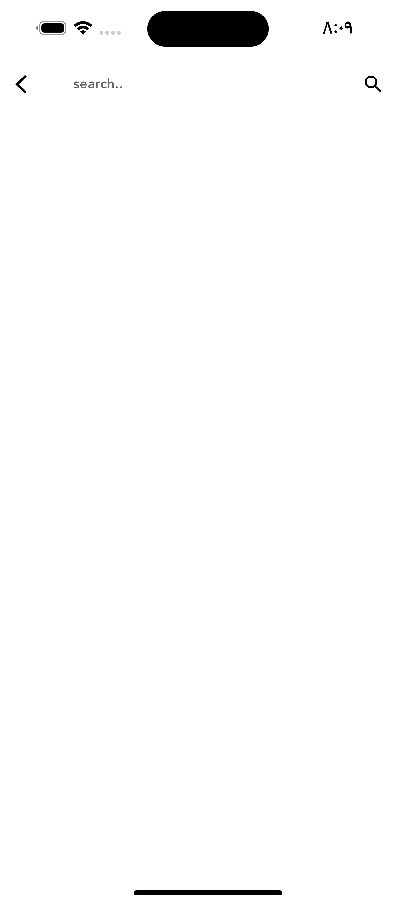
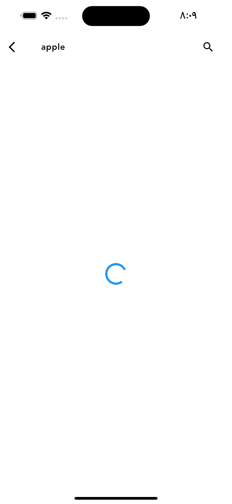
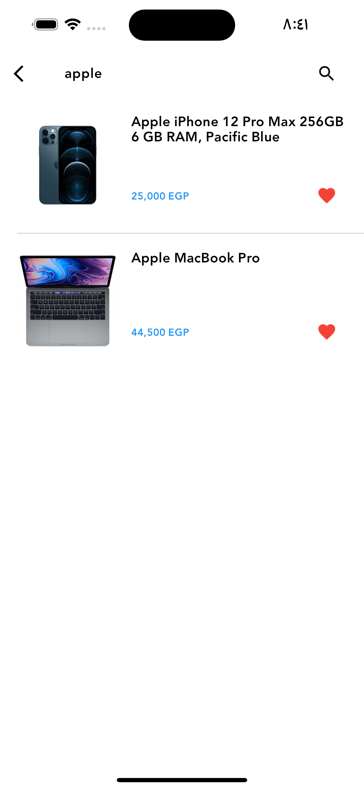
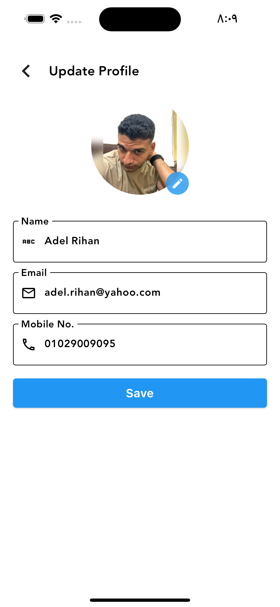
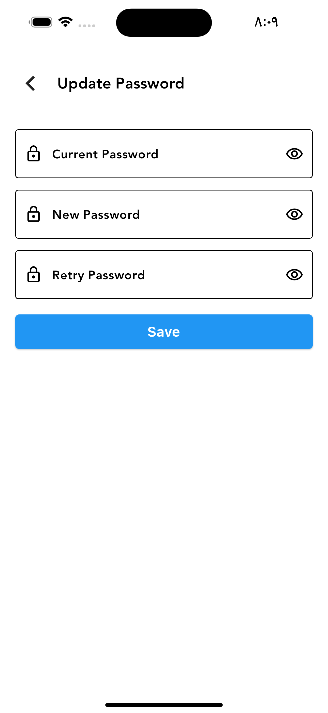
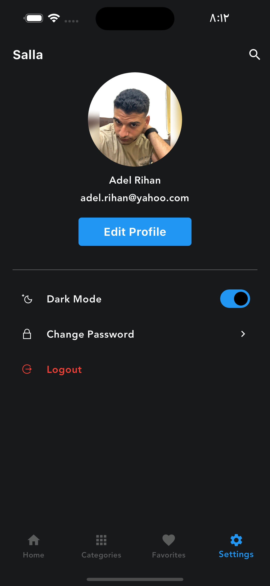
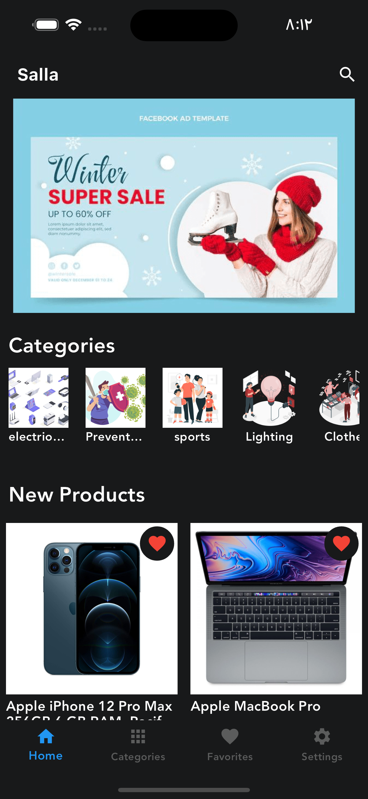
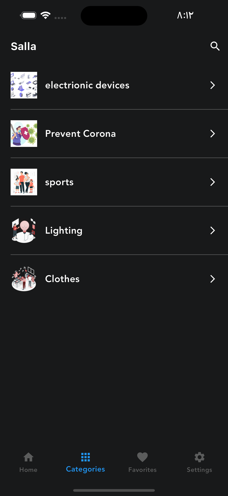
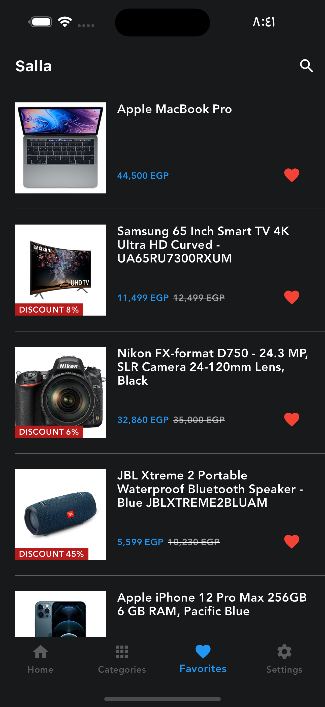
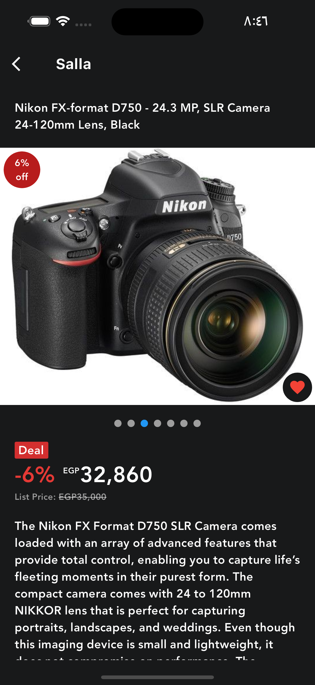
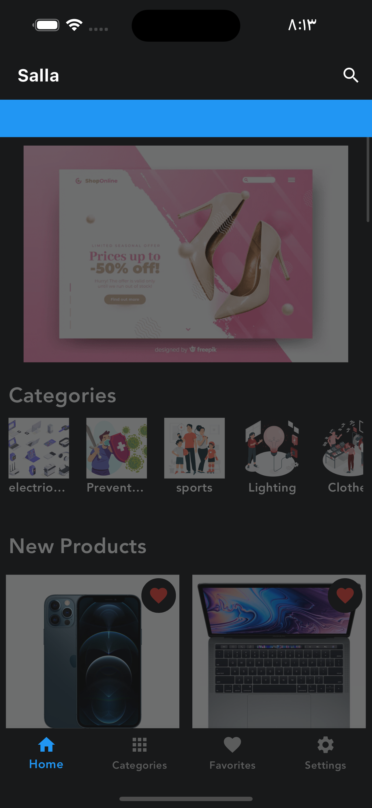
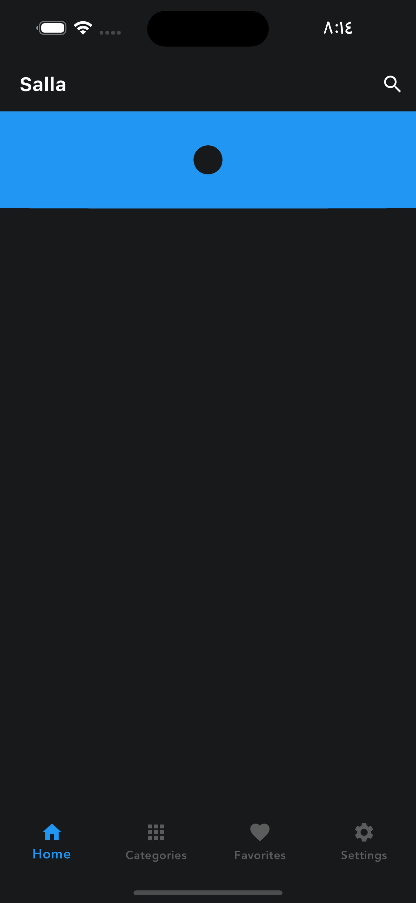

